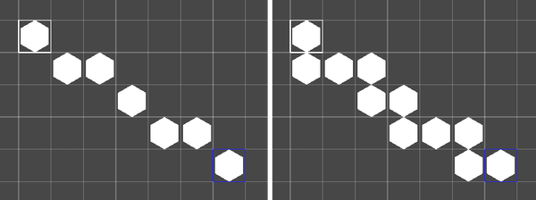

# Paint a line of tiles

To paint a line of tiles, use the line brush in the **Tile Palette** window. Follow these steps:

1. Open the [**Tile Palette** window](https://docs.unity3d.com/Manual/tilemaps/tile-palettes/tile-palette-editor-reference.html).
2. In the Brush Inspector section at the bottom, set the brush to **Line Brush**.
3. Select the **Paint with Active Brush** () tool and select a tile.
4. Click once in the **Scene** view to start the line, and again to end the line. 

To avoid gaps when you paint diagonal lines, enable **Fill Gaps** in the Brush Inspector window.

## Line Brush Inspector window properties

| **Property** | **Function** |
|:--|:--|
| **Fill Gaps** | Adds extra tiles to prevent gaps when tiles connect only diagonally. |
| **Line Start** | After you click once in the **Scene** view to start the line, displays the position of the start tile. Enter different values to change the position of the start tile. |
| **Lock Z Position** | Locks all the tiles in the line to the z position of the start tile. |
| **Scene View Z Position** | Paints the line at this z position. This property is available only if you disable **Lock Z Position**. |
| **Palette Z Position** | Paints a line in the tile palette at this z position. This property is available only if you disable **Lock Z Position**. |

## Additional resources

- [Paint random tiles](RandomBrush.md)
